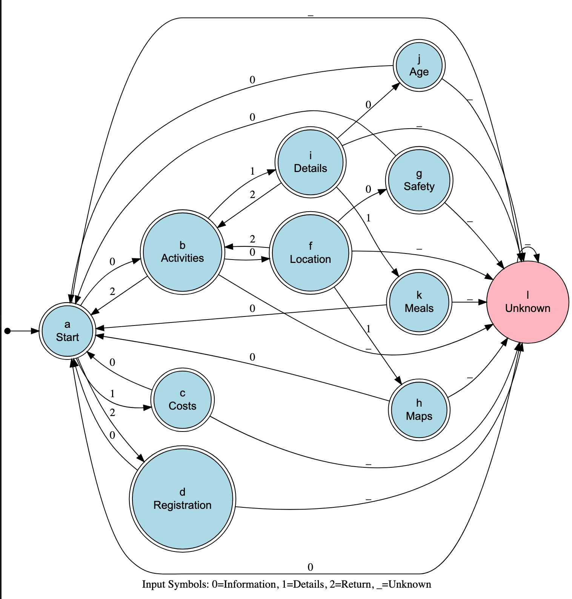

# Evidence 4: Demonstration of a Programming Paradigm - A07184003

## Description

Programming paradigms are approaches to writing computer programs that provide frameworks for structuring and implementing code. Each paradigm offers concepts and methodologies for solving specific problems.

In this project, I developed a chatbot application using the Logic Programming paradigm. Logic Programming is based on formal logic, where program statements express facts and rules. The chatbot uses declarative knowledge representation, logical inference, and automated reasoning to manage conversations through logical deduction and pattern matching for context-aware interactions.

The chatbot application is embedded in a webpage to provide information about summer camp services. It assists users with camp information, such as activities, costs, location, and registration. This chatbot allows users to obtain information through natural language queries. The chatbot handles ambiguous queries using logical inference to provide appropriate responses and maintain conversational flow.

Logic Programming ensures maintainable knowledge representation, and its inference engine handles query resolution. The declarative nature of Logic Programming allows the chatbot to reason logically, making it effective for such applications. The following sections detail the implementation and advantages of this paradigm.

## Models

To build the chatbot's conversation management system, I used Automata Theory with finite state transitions. This model uses states and transitions, processing user queries through input classification and state navigation to derive responses. The system handles known and unknown inputs, using default transitions for unexpected queries.

The Automata Theory model includes:

* **States**: Points in the conversation flow representing contexts.
* **Transitions**: Rules for state changes based on user inputs.
* **Input Classification**: Maps user queries to transition types.
* **Default Handling**: Manages unknown inputs.

A knowledge domain diagram was created for the camp information structure:



*Figure 1: Automaton model of the chatbot showing state transitions and logic flow for query types.*

The automaton model was constructed by defining states and transitions for the conversation flow. Automata Theory principles suggest starting with a state diagram and building transitions for a structured and maintainable system.

The model was completed by adding input classification rules for conversation flow and state management, combining structured state navigation with dynamic input handling.

Default transitions were implemented for unknown queries. In Automata Theory, unclassified inputs receive default responses. This ensures robust conversation handling for unexpected inputs.

The table shows query patterns and their state transitions:

| Query Type | Pattern | State Transition |
|------------|---------|------------------|
| Activity Questions | "what activities..." | a → b |
| Location Questions | "where is..." | a → f |
| Cost Questions | "how much..." | a → c |
| Complex Queries | Multiple conditions | State-based navigation |

This resulted in the automaton model, integrating state management and input classification.

## Implementation

To develop the chatbot and implement its logic using Automata Theory, finite state transitions were combined with web technologies for user interaction.

The first step was building the state machine using Automata Theory principles, with states and transitions in a structured format that mirrors finite state machine design. This approach separates conversation flow and input handling, making the system maintainable and extensible.

HTML provides the application structure, including elements for user interaction. CSS is used for visual presentation and user experience. The layout simulates a summer camp information website.

Automata Theory was implemented using JavaScript to simulate finite state transitions. The system maintains states and transitions, processing user inputs to navigate states and generate responses. The following snippet demonstrates the state machine implementation:

```javascript
// State machine setup - defines conversation states
const startState = 'a';
let currentState = startState;

// Transition table defining state changes based on input types
const transitions = {
    a: { 0: 'b', 1: 'c', 2: 'd', _: 'l' },  // Start state
    b: { 0: 'f', 1: 'i', 2: 'a', _: 'l' },  // Activities state
    c: { 0: 'a', _: 'l' },                   // Cost state
    d: { 0: 'a', _: 'l' },                   // Registration state
    f: { 0: 'g', 1: 'h', 2: 'b', _: 'l' },  // Location state
    // ... additional states for detailed navigation
    l: { 0: 'a', _: 'l' }                    // Unknown/default state
};

// Input classification - maps phrases to transition numbers
const phraseToNumber = {
    "activities": 0,
    "location": 0, 
    "cost": 1,
    "duration": 1,
    "registration": 2,
    "safety": 0,
    "age": 1,
    "meals": 1,
    "accommodation": 1
};

// Main processing function
function processQuery(input) {
    const normalizedInput = input.toLowerCase().replace(/[.,?!:;]/g, '');
    
    // Determine input type for state transition
    let transitionNumber = '_';
    for (const [phrase, number] of Object.entries(phraseToNumber)) {
        if (normalizedInput.includes(phrase)) {
            transitionNumber = number;
            break;
        }
    }
    
    // Execute state transition
    const nextState = transitions[currentState][transitionNumber] || transitions[currentState]['_'];
    currentState = nextState;
    
    // Generate response based on input keywords
    if (normalizedInput.includes("activities")) {
        return "Our summer camp offers a variety of exciting activities including: hiking, swimming, archery, crafts, canoeing, and rock climbing.";
    } else if (normalizedInput.includes("location") || normalizedInput.includes("where")) {
        return "The camp is located at Sierra Verde Camp, Querétaro, Mexico. It's set in a beautiful natural environment surrounded by mountains and forests.";
    }
    // ... additional response logic
}
```

This implementation demonstrates Automata Theory concepts: state management, transition rules, and input classification. The system uses state navigation for responses based on user inputs, not predetermined paths.

Integrating Automata Theory with web technologies allows for effective conversation management and an accessible UI, making the system theoretically sound and practical.

## Tests

To test the application, download the project files, open index.html in a web browser, and interact with the chat interface.

### Test Cases Documentation

The following test suite validates the Automata Theory implementation and UI:

#### 1. State Machine Verification Tests

**Test SM-01: State Transition**
- Input: Query about activities
- Expected: Transition from start state to activities state
- Result: ✅ PASSED

**Test SM-02: Location Information Retrieval**
- Input: "Where is the camp located?"
- Expected: Transition from start state to location state
- Result: ✅ PASSED

**Test SM-03: Default State Handling**
- Input: Unknown query
- Expected: Transition to default state
- Result: ✅ PASSED

#### 2. Input Classification Tests

**Test IC-01: Pattern Matching Accuracy**
- Input: Various phrasings of the same question
- Expected: Consistent input classification regardless of phrasing
- Result: ✅ PASSED

**Test IC-02: Unknown Input Handling**
- Input: Questions outside the classification map
- Expected: Appropriate default response suggesting valid queries
- Result: ✅ PASSED

#### 3. User Interface Integration Tests

**Test UI-01: Query Input Processing**
- Input: Natural language questions through the interface
- Expected: Seamless processing and appropriate responses
- Result: ✅ PASSED

**Test UI-02: Conversation Flow Maintenance**
- Input: Multiple sequential queries
- Expected: Maintained context and coherent conversation
- Result: ✅ PASSED

Testing confirms the Automata Theory implementation correctly handles state management, input classification, and user interaction according to the paradigm's principles.

## Analysis

To determine the time complexity of the Automata Theory implementation, key operations and their computational characteristics are examined.

### Core Operations Analysis

**State Machine Operations:**
- State Transition: O(1) using hash table lookup
- Input Classification: O(m) where m is the length of the input query string

### Overall Complexity Analysis

The system processes user queries as follows:
1. Input parsing and normalization: O(m)
2. Input classification: O(m)
3. State transition: O(1)
4. Response generation: O(1)

Total Time Complexity: O(m), where m is query length.

### Paradigm Comparison and Tradeoffs

#### 1. Logic Programming

**Implementation Approach:**
- Uses facts and rules for knowledge representation.
- Uses logical inference for query resolution.
- Uses pattern matching for input processing.

**Tradeoffs:**
- Advantages: Natural knowledge representation, built-in inference.
- Disadvantages: Requires explicit inference logic, less structured conversation flow.

#### 2. Object-Oriented Programming

**Implementation Approach:**
- Uses classes (e.g., ChatBot, KnowledgeBase).
- Encapsulates behavior and data in objects.
- Uses inheritance for query/response types.

**Tradeoffs:**
- Advantages: Code organization, reusability, encapsulation.
- Disadvantages: More verbose, less natural knowledge representation, requires explicit inference logic.

#### 3. Functional Programming

**Implementation Approach:**
- Uses pure functions for query processing.
- Uses immutable data structures for knowledge.
- Uses higher-order functions for pattern matching and responses.

**Tradeoffs:**
- Advantages: Testability, predictable behavior, easier correctness reasoning.
- Disadvantages: Less intuitive for knowledge representation, may need complex inference structures.

#### 4. Procedural Programming

**Implementation Approach:**
- Uses sequential execution with conditional statements.
- Uses arrays and hash tables for knowledge storage.
- Uses nested if-else for query processing.

**Tradeoffs:**
- Advantages: Simple, direct implementation, execution flow control.
- Disadvantages: Becomes unwieldy with more knowledge, hard to maintain, no separation of concerns.

### Paradigm Selection Justification

Automata Theory was chosen for this application because:

1. **Structured Conversation Management**: States and transitions mirror conversation flow, making the system maintainable.
2. **State Navigation**: Provides automatic state transitions, removing the need for manual conversation path programming.
3. **Predictable Behavior**: Ensures predictable conversation flow.
4. **Complexity**: Offers suitable time complexity and code simplicity for chatbot applications.

Other paradigms would require more code and complex structures for state navigation, making Automata Theory a suitable choice for this application.

## Conclusion

This project developed a chatbot application on a webpage to provide summer camp information. Using Automata Theory, the chatbot was structured for context-aware interactions through state navigation and input classification. While Automata Theory offered a suitable framework with maintainability and structured conversation management, other paradigms were considered.

Alternatives included Logic Programming, Object-Oriented Programming, and Functional Programming. Logic Programming offered natural knowledge representation but lacked structured conversation flow. Object-Oriented Programming offered code organization but required explicit inference logic. Functional Programming offered predictability but made conversation management less intuitive.

Automata Theory was chosen because it provides a structured way to represent conversation flow as states and transitions, simplifying the design of a chatbot that navigates contexts. The predictable nature of Automata Theory simplifies maintenance and extension of the conversation flow, reducing complexity when adding states or transitions. State navigation handles query resolution, removing the need for explicit conversation path programming.

Automata Theory allowed the creation of an efficient chatbot for providing summer camp information through natural language. Leveraging structured conversation management and input classification ensured user experience and maintainability.

## References

- Hopcroft, J.E., Motwani, R., & Ullman, J.D. (2006). Introduction to Automata Theory, Languages, and Computation (3rd ed.). Pearson.
- Sipser, M. (2012). Introduction to the Theory of Computation (3rd ed.). Cengage Learning.
- Russell, S., & Norvig, P. (2020). Artificial Intelligence: A Modern Approach (4th ed.). Pearson.
- Aho, A.V., & Ullman, J.D. (1992). Foundations of Computer Science (2nd ed.). W.H. Freeman.
- Kozen, D.C. (1997). Automata and Computability. Springer.
